# 量化验证平台（Quant Platform）

面向研究与模拟交易的本地量化工作台。平台把数据证据、策略运行、结果审查和任务调度放在同一条可追溯链路中；它**不是实盘交易系统**，真实下单能力永久默认关闭。

[](https://github.com/feng653/quant-platform/actions/workflows/ci.yml)

> 研究真实性规则：实验和模拟必须绑定可复现的数据代、窗口和风险快照。来源等级、PIT
> 不完整和跨源冲突会显著告警，但在仍有可计算数据时不统一阻断个人研究/模拟；无数据、
> artifact 损坏、身份不一致或账本不守恒仍失败关闭。未来实盘持续硬锁。

## 能力边界

| 模块 | 可以做什么 | 不能据此宣称什么 |
|---|---|---|
| 实验中心 | 策略回测、参数扫描、可恢复任务、结果和证据查看 | 未绑定 PIT、价格账本及交易状态的结果不是无偏或可实盘结果 |
| 因子研究 | 因子目录、IC/分层、相关性、稳定性和安全导出到策略池 | 因子研究不自动发布、更不自动接入真实资金 |
| 数据中心 | PIT 就绪度、归档证据、时间线和数据状态查看 | 当前成分股快照不能作为历史成分时间线 |
| 策略相关性 | 对已完成实验的收益路径、尾部相关和分散化诊断 | 相关性不是未来收益承诺，也不自动构建组合 |
| 交易工作台 | 模拟组合、订单/持仓/信号和模型生命周期管理 | 平台无真实券商下单路由，实盘门禁保持关闭 |
| 任务中心 | 查看、恢复、取消受权限约束的后台任务 | 任务完成不等于数据已满足研究真实性门槛 |

完整的证据模型、当前缺口和实盘门禁在 [ROADMAP](docs/ROADMAP.md) 与 [PIT 主数据说明](docs/POINT_IN_TIME_MASTER.md) 中维护。

## 架构与数据安全要点

```text
供应商原始响应/官方材料 → 内容寻址留存 + checkpoint → 校验/归一化
                                              ↓
                                  不可变研究 generation
                                              ↓
数据中心切源/冲突 → 实验 manifest + 风险快照 → 不可变模拟版本/每日对账

未来实盘（暂停）：许可 + 严格双时态 PIT + 双价格账本 + 独立风控/审计
```

- Tushare 可作为个人研究候选主源；原始响应、hash、覆盖、失败和已知 PIT 局限必须留存。
- 研究 generation 原子发布，旧代不被覆盖；来源、窗口、告警和数据 hash 随运行固定。
- “未比较”与“无冲突”严格区分，不允许静默回退到旧缓存或混用数据代。
- 研究/模拟允许在确认风险后继续；技术完整性问题仍阻断，实盘资格始终为 false。
- 严格许可、独立复核、权威逐日状态和 raw/adjusted 双账本保留为未来实盘条件，不增加
  当前个人研究的审批操作。

## 安装与启动

### 1. 前置条件

- Python 3.11
- Node.js 20+ 与 npm
- macOS Apple Silicon 使用 LightGBM/XGBoost 时：`brew install libomp`

```bash
git clone https://github.com/feng653/quant-platform.git
cd quant-platform
python3.11 -m venv .venv
.venv/bin/pip install -r requirements.txt
cd frontend && npm ci && cd ..
```

### 2. 配置环境

在项目根目录创建权限为仅本人可读的 `.env`。不要把真实密钥、管理员口令或令牌提交到 Git。

```env
ENVIRONMENT=development
JWT_SECRET=replace-with-a-long-random-secret
BOOTSTRAP_ADMIN_TOKEN=replace-with-a-separate-random-token
CORS_ORIGINS=["http://localhost:5173"]

# 可选：AI 解读；不配置时 AI 功能会明确不可用
DEEPSEEK_API_KEY=
DEEPSEEK_BASE_URL=https://api.deepseek.com
```

常用资源预算可按本机容量配置：

```env
JOB_SCHEDULER_ENABLED=true
JOB_SCHEDULER_MAX_CONCURRENCY=2
JOB_SCHEDULER_MIN_AVAILABLE_MEMORY_MB=1536
JOB_SCHEDULER_MAX_PENDING_JOBS=500
```

完整负载调度说明见 [本机动态负载调度](docs/DYNAMIC_JOB_SCHEDULER.md)。生产环境请使用项目提供的部署和守护脚本；不要用 `--reload` 代替守护进程。

### 3. 本地启动

终端一：

```bash
.venv/bin/python -m uvicorn backend.main:app --host 127.0.0.1 --port 8000
```

终端二：

```bash
cd frontend
npm run dev
```

打开 <http://localhost:5173>。启动后可用 `curl http://127.0.0.1:8000/api/health` 检查服务身份与健康状态。生产部署不要向公网暴露 `/docs` 或 `/openapi.json`。

## 从个人安全模式到灾备恢复：全链路教程

以下截图均为已有的真实本机网页捕获，只展示界面，不包含口令、令牌或私密数据。它们不是生产数据、也不是测试 fixture 的替代品；角色权限和 PIT readiness 会改变可见操作。截图中的“未认证”或“数据未就绪”是必须保留的安全门禁。

> **当前状态（先读）**：平台正在把 Tushare checkpoint 物化为独立 ResearchDataStore。
> 数据页显示的实际 active generation、覆盖和任务进度才是运行事实，文档不预先宣称已经
> 回填完整。研究/模拟可在有实际可计算数据时携带高风险告警继续；生产 PIT/双账本、权威
> 交易状态和公司行为尚未认证，因此不能推导无偏或实盘结论。真实下单路由不存在，
> `ready=false`。详见 [路线图](docs/ROADMAP.md) 和
> [研究数据管理](docs/RESEARCH_DATA_MANAGEMENT.md)。

### 1. 个人安全模式：先保护本机和身份

以本机研究/模拟为边界运行服务：使用仅本人可读的 `.env`、独立管理员账号、最小权限和回环监听/受控反向代理。不要共享管理员凭证、把密钥提交到 Git，或把开发服务器直接暴露到公网。生产部署的网络收口、文档关闭、备份任务和回滚步骤以 [本机网络边界、加密备份与恢复演练](docs/LOCAL_SECURITY_AND_RECOVERY.md) 为准；该文档也明确当前未安装的部署项。

管理员通过受控首次引导创建，普通用户再由管理员授予最小权限。

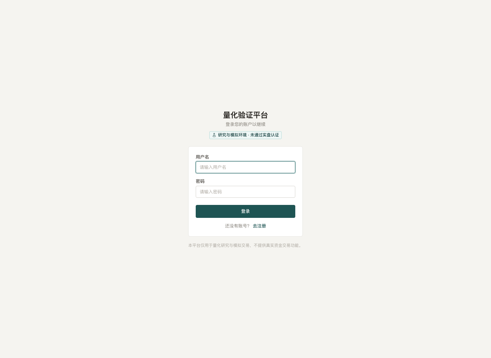


登录后先检查总览中的任务、数据就绪度和研究/模拟状态；“完成”本身不是数据可用或可晋级的证明。

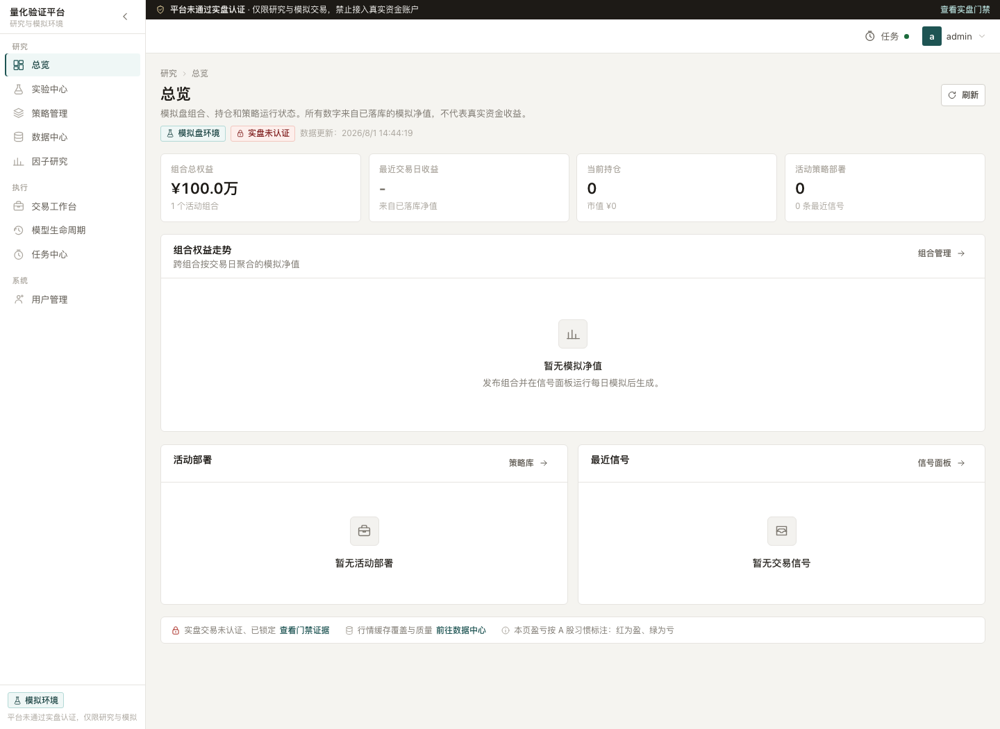

### 2. 数据管理：先确认实际研究代，再开始实验

数据中心把严格生产治理与个人研究数据分开显示。对当前个人研究，选择 Tushare 主源后
提交“研究数据刷新”；后台按 checkpoint 有界采集并可续跑，再把 exact-run artifact
流式物化为不可变 SQLite generation。成功发布只原子切换研究 active pointer，不会写入
或冒充 `certified_live` 数据。

页面必须显示真实的计划、完成、待处理、失败数量，及行情/证券/股票池/状态/基准的覆盖
区间。任务显示完成时仍要核对 active generation 和行数；`0/0`、空月、来源不支持和
调用失败不能显示成已有数据。四个 CSI 池和 `all_a` 按查询日使用当时可用的成员/证券
状态，当前证券信息不得泄漏到更早日期。

来源报告把 Tushare 主源、BaoStock/AKShare 等校验源的实际留存状态分开。每个冲突应能
下钻到证券、日期、字段、两侧值和容差；校验源不可用时显示“未比较”及原因，而不是
“无冲突”。单源、覆盖缺口、月内调样不完整、停牌时点模糊和 raw/HFQ 退化都会进入后续
实验和模拟风险快照。

严格生产 PIT 的 `collect → validate → classify → review → import → activate`、许可证明、
独立复核和完整双价格账本仍保留给未来实盘，不是个人研究更新的人工审批步骤。任何 token
只放在权限受限的 `.env` 或密钥存储，不进入日志、manifest、截图或 Git。

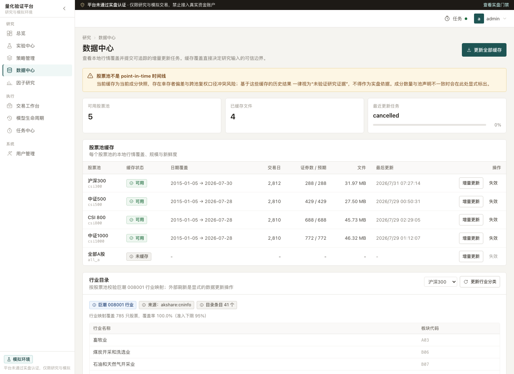

### 3. 实验：技术阻断与数据风险分开

先选择股票池、数据窗口、策略和参数。readiness 应分别显示 `runnable`、可信度、结构化
warnings 和 technical blockers：来源/PIT/冲突/双价格不足可在确认后继续个人研究；没有
可计算价格、窗口完全无覆盖、artifact 损坏、参数非法或模型身份错误必须修复后再提交。

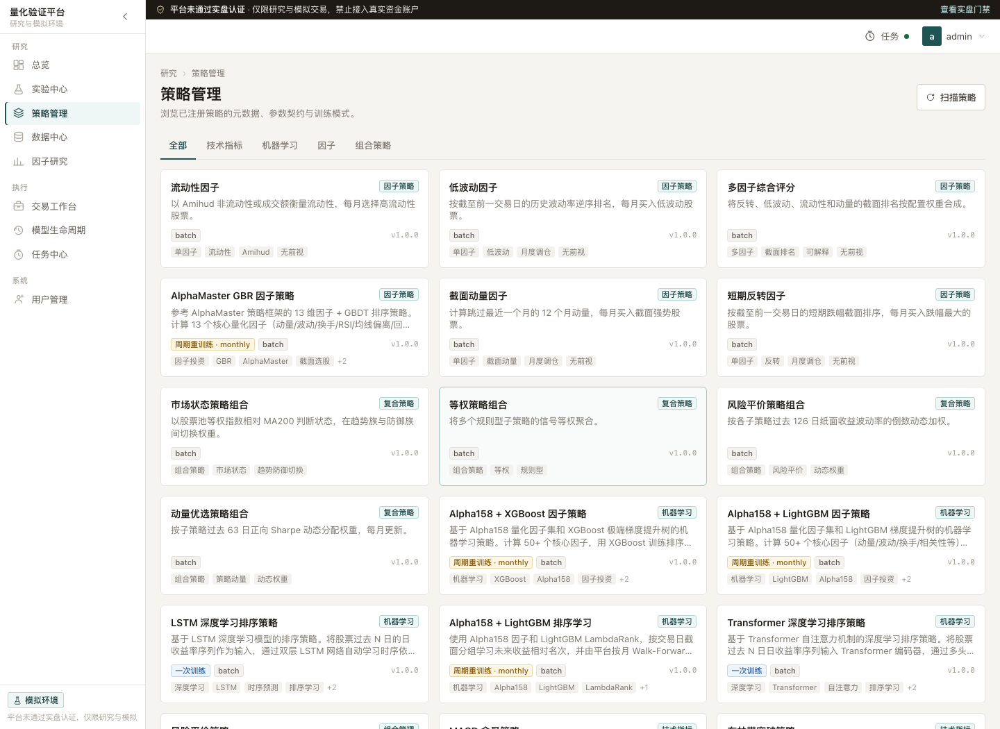

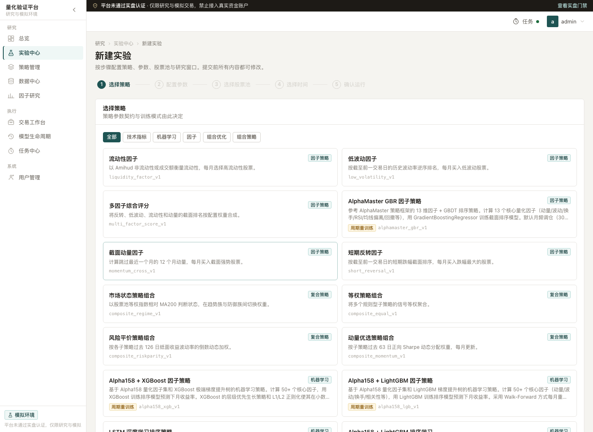

提交后核对实验已入库 generation、来源、覆盖、窗口、代码/参数和告警快照。结果页的收益、
回撤、成本、容量和稳健性只能在声明的数据边界内解释；当前快照、短窗口或单源风险不能被
隐藏。旧记录和 synthetic acceptance 只可用于链路审计，不冒充市场结论。

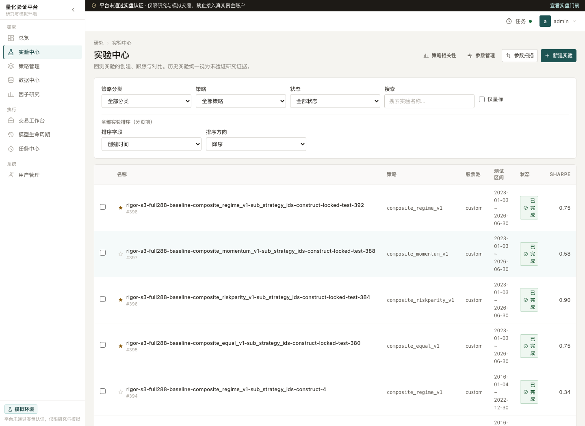

### 4. 因子研究与高级 promotion

因子研究独立完成单/多因子 IC/分层、衰减、换手、成本、容量、相关性、稳定性和边际贡献。
导出策略必须绑定同一组合运行的 generation、窗口、预处理、执行延迟、因子版本、冻结权重
和告警，不能从多个数据代或运行任意拼接。

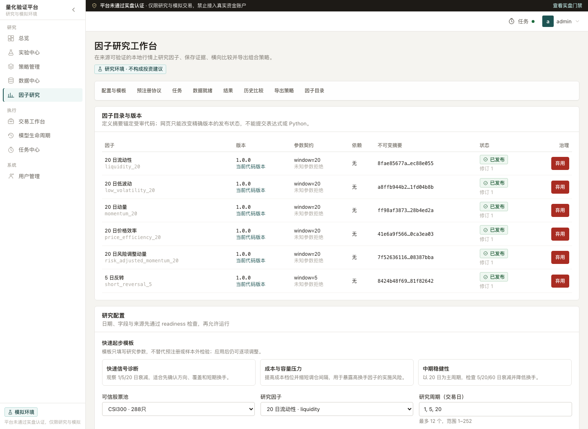

训练型候选还须在模型生命周期中审阅训练、验证、失败与冠军版本证据；自动重训只可提交受控任务，不能自动晋级或发布。

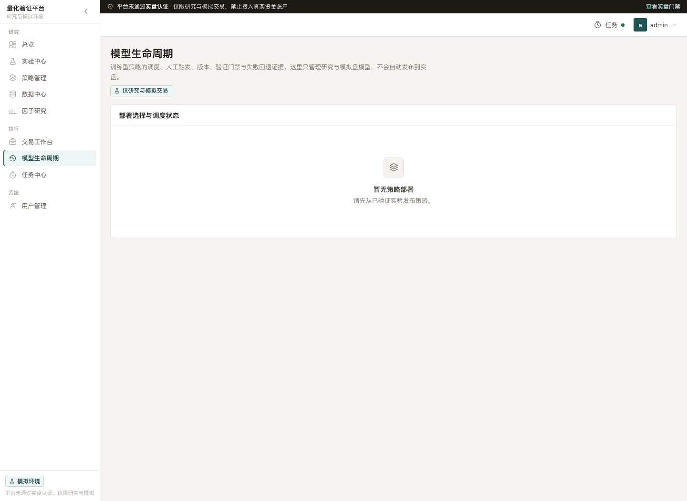

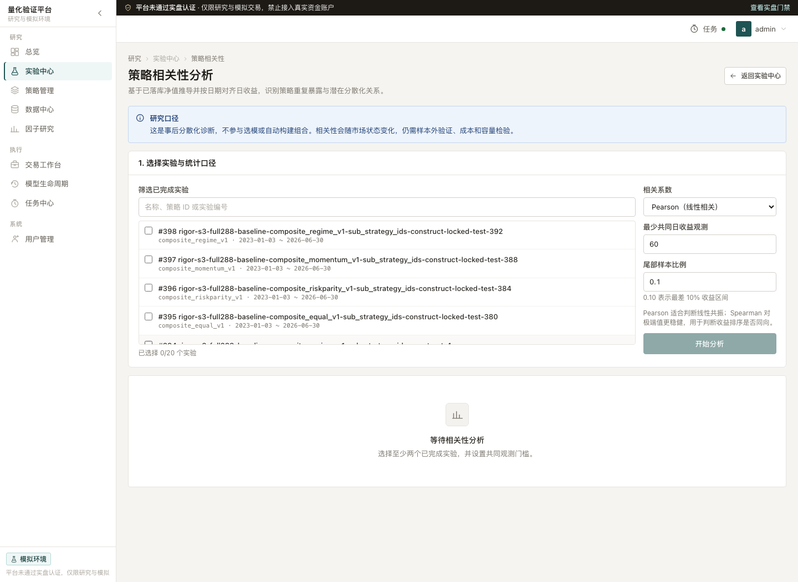

严格 promotion 是可选的高级可信度证明：它用于预注册、selection、独立 locked test、
不可变报告及 draft/reviewed/approved/revoked 状态，不是个人模拟盘的必填审批。当前前端
可将 promotion ID 留空并记录高风险告警；v0.2.3 将把内部 ID 从默认流程隐藏。无论是否
approved，都不授予真实资金权限。长任务失败、取消和重试仍在任务中心留证。

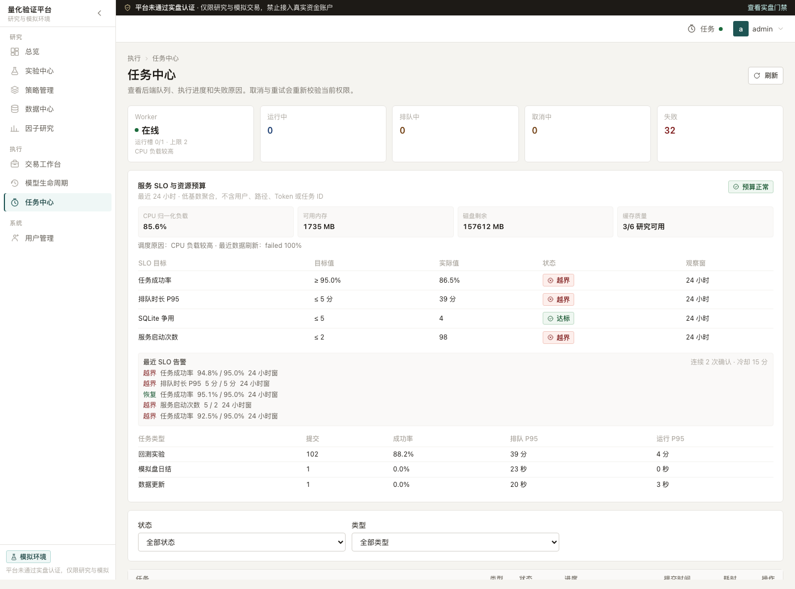

### 5. 模拟观察：确认一次风险，发布不可变版本

当前流程是在已完成实验中选择/创建一个模拟盘、填写目标仓位、可选填写 promotion ID，
再确认部署；记录与该模拟盘新版本原子提交，其他模拟盘不变。缺少 promotion、严格 PIT、
完整双账本或权威状态会持续告警，但只要来源实验、manifest、策略/参数/模型和可执行数据
技术正确即可进入 paper。详细当前操作、已知限制和 v0.2.3 简化目标见
[模拟盘产品闭环](docs/PAPER_TRADING_WORKFLOW.md)。

模拟目标是每日收盘计算信号，给出下一交易日早盘的证券/方向/数量/权重/金额/原因/限制，
并展示价格、持仓、现金、费用带来的收益变化。策略组合、参数、模型、数据代和风险绑定一旦
发布不得原地修改；调整只能生成新版本，防止策略和持仓语义中途突变。

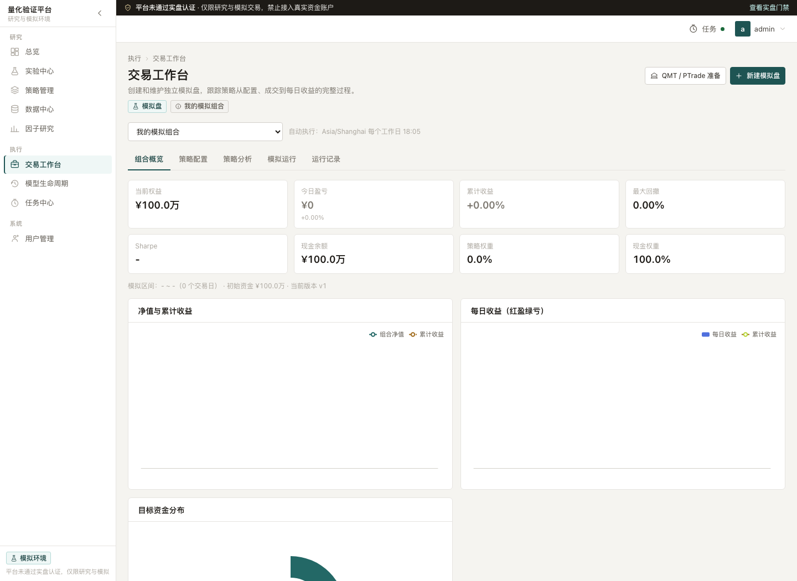

执行安全治理页展示的是硬锁，不是可开通的交易按钮：当前没有真实券商下单路由，QMT/PTrade 仅有探测与拒绝式骨架。研究或模拟完成绝不构成实盘认证。

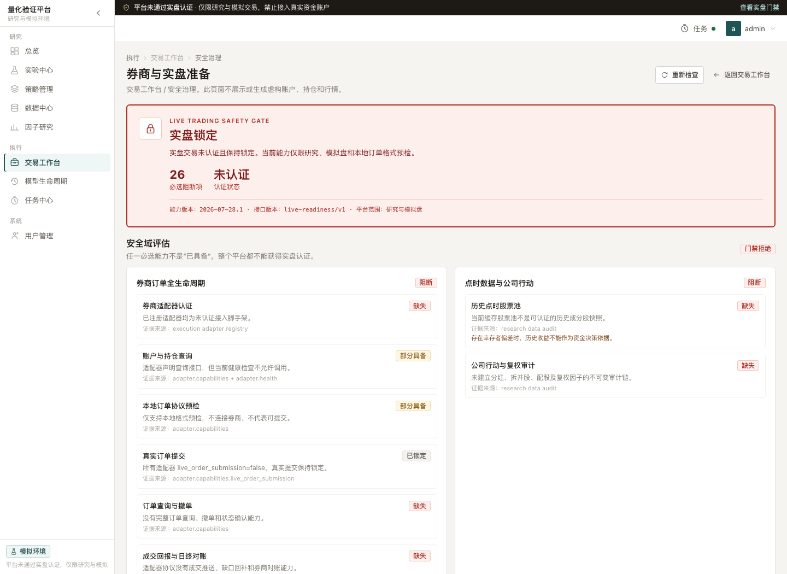

### 6. 备份与恢复：只备份加密密文，先演练再谈恢复

每日备份使用 SQLite online backup、完整性检查、scrypt + AES-256-GCM 加密和 manifest 哈希。恢复密钥不进入仓库、plist、环境变量、日志或备份本身；丢失密钥即无法恢复。先在隔离目录运行恢复演练，核对 archive、commit、迁移与数据库完整性；恢复工具不会覆盖生产数据库。

可选的 GitHub 异地副本只上传 `.qpbak` **加密备份**作为 private Release asset，绝不上传 `.env`、密钥、数据库、日志、audit 或其他明文，也不把备份写入 Git 提交。目标 private 仓库配置、首次上传和 Release 变更须由账号负责人执行；远端失败时本地密文保留。命令、保留策略、下载校验和恢复演练见 [本机网络边界、加密备份与恢复演练](docs/LOCAL_SECURITY_AND_RECOVERY.md#31-github-private-异地副本可选)。

### 网页截图覆盖与待补捕获

| 环节 | 当前真实截图 | 尚待真实捕获（不得用 fixture 或合成图替代） |
|---|---|---|
| 个人安全模式 | 登录、总览、用户管理 | 已完成安全安装后的回环监听/文档关闭状态页（去除主机与账号信息） |
| 研究数据更新 | 数据中心/数据治理 | 最新 Tushare 回填进度、active generation、四池/全市场覆盖和字段冲突/未比较 |
| 实验与因子 | 策略库、新建实验、实验中心、因子、相关性、任务中心 | 同一研究代上的真实单策略、单/多因子、告警确认、相关性和可信导出 |
| 模拟观察 | 模拟工作台、执行安全治理 | 一键加入模拟观察、不可变版本、次晨操作清单、每日收益归因和 canary |
| 备份恢复 | 无网页客户端截图 | 已安装备份任务的脱敏状态、下载校验和隔离恢复演练结果；不得展示 archive 内容、密钥或生产数据库 |

### 发布前的最小验收

1. 在隔离测试库确认 generation、manifest、source batch、窗口、hash 和告警不可静默改变；fixture 不进入生产库或冒充市场结论。
2. 验证无数据、损坏、身份不一致和账本错误被结构化阻断；来源/PIT/冲突/promotion 风险在研究与 paper 可确认继续并永久留证；live 始终拒绝。
3. 用真实浏览器完成数据更新→实验→因子/比较→模拟观察，并逐项核对前端、数据库、任务和证据包。
4. 启用异地备份前后，验证 Release 中只存在校验通过的 `.qpbak` 密文；下载后在隔离目录完成恢复演练，绝不自动覆盖生产服务。

## 开发、测试与文档截图

```bash
# 后端静态检查与测试
.venv/bin/ruff check backend/ tests/integration/ conftest.py
.venv/bin/pytest -q backend/tests tests/integration --tb=short

# 前端检查、组件测试与构建
cd frontend
npm run lint
npm test -- --run
npm run build
```

README 截图由真实本地页面生成，而非合成图。维护者可在已启动的本地服务上使用（凭证只从环境变量读取，不写入文件）：

```bash
npm install --no-save playwright
QUANT_DOC_USERNAME=your_user QUANT_DOC_PASSWORD=your_password \
  node scripts/capture_readme_screenshots.mjs
```

## 目录与进一步文档

```text
backend/       FastAPI、数据治理、策略、任务与交易模拟
frontend/      React 前端
data/          本机运行时数据库、受管缓存与证据（不提交）
docs/          API、PIT 主数据、数据安全和路线图
scripts/       受控运维、采集与文档辅助脚本
tests/         跨模块集成测试
```

- [API 文档](docs/API.md)
- [文档状态索引](docs/DOCUMENT_INDEX.md)
- [PIT 主数据与治理](docs/POINT_IN_TIME_MASTER.md)
- [版本化路线图与当前边界](docs/ROADMAP.md)
- [实际工作唯一索引](docs/todo/TODO_INDEX.md)
- [策略实现与规范](docs/strategies/)

本项目仅用于研究与模拟。收益指标、参数扫描结果、因子报告和模拟订单均不构成投资建议或实盘认证。
