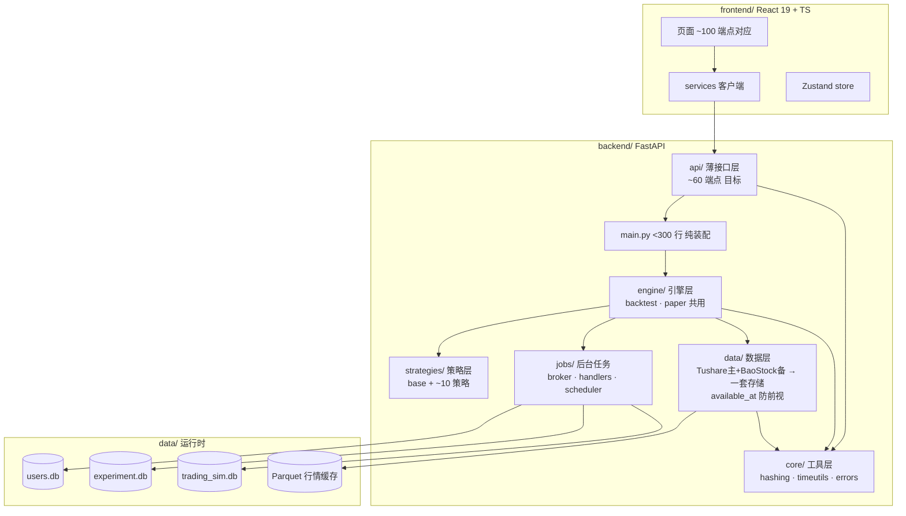
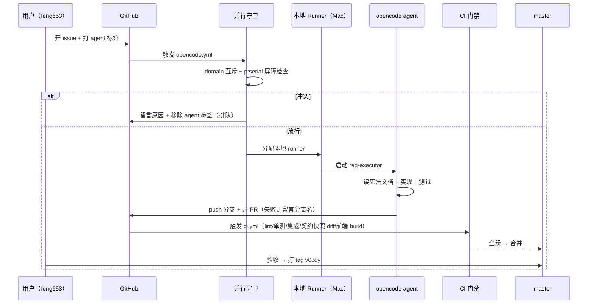
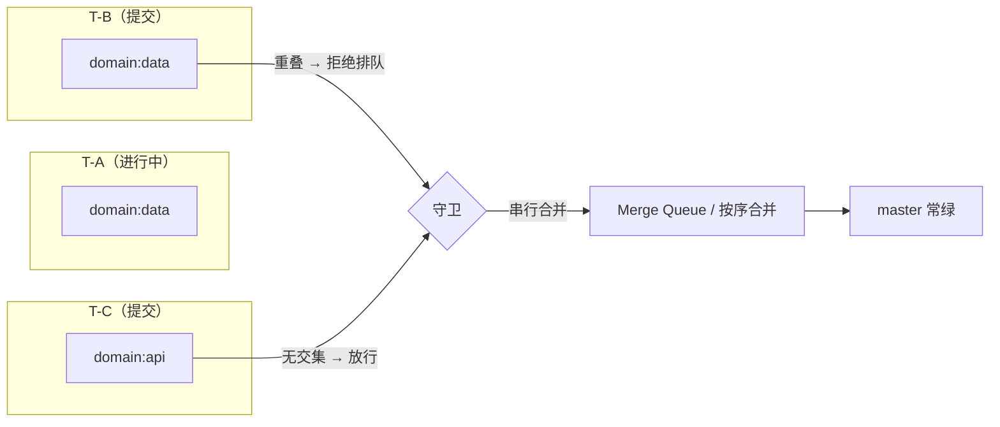

# 北极星代码架构（目标形态）

> 现状 v0.2.2 快照：backend 100,788 行 / 312 文件；前端 29,304 行；端点 181。目标见文末验收标准。

## 目标目录

```
backend/                    ≈2.5 万行（现在 10 万）
├── main.py                 <300 行：只装配路由和启动，不含任何业务
├── config.py               全部配置一个文件
├── core/                   工具层（每个工具全项目只此一份）
│   ├── time.py             时间：now_utc / 序列化 / 日期解析
│   ├── hashing.py          指纹：canonical JSON + sha256
│   └── errors.py           错误定义
├── data/                   数据层（唯一数据出入口）
│   ├── sources/
│   │   ├── tushare.py      主源（付费，干净）
│   │   └── baostock.py     备份源（免费，主源挂了兜底）
│   ├── store.py            一套存储：Parquet 价格 + SQLite 元数据 + available_at
│   └── quality.py          质量检查（缺失/跳变/NaN 自动告警）
├── strategies/             策略层
│   ├── base.py             信号协议：输入数据 → 输出 (日期, 代码, 分数)
│   └── technical/ ml/      约 10 个策略，每个 <200 行
├── engine/                 引擎层（实验和模拟盘共用同一个）
│   ├── backtest.py         回测：T日信号 → T+1成交 → 净值/指标/清单
│   └── paper.py            模拟盘：同一引擎 + 每天只推进一天 + 幂等
├── jobs/                   后台任务：调度器 + 幂等防重跑
└── api/                    ~60 端点：只做参数校验和转发
frontend/                   ≈1.5 万行（现在 2.9 万）：只留实际使用 ~100 端点对应页面
```

## 每层合同（输入 → 输出）

| 层 | 输入 | 输出 | 严谨点 |
|---|---|---|---|
| 数据层 | 交易日 + 股票池 | 每股 OHLCV + 复权因子，每条带 available_at（何时可见） | 防前视靠 available_at，不靠双账本 |
| 策略层 | 数据框 + 参数 | 信号表 (日期, 代码, 分数) | 格式统一，训练/预测分离 |
| 引擎层 | 信号 + 组合配置 | 净值曲线、交易流水、指标、实验清单 | 清单强制生成；同一天不重复跑 |
| 接口层 | 请求体（pydantic 校验） | {"data": ...} 统一包装 | 响应结构全被快照锁定 |

## 简单 vs 严谨对照

| 层 | 坚决简单（个人用） | 必须严谨（保护资产/可信度） |
|---|---|---|
| 数据 | 一套存储；Tushare 主 + BaoStock 兜底；不搞双源交叉验证 | 复权口径统一；available_at 防前视；质量检查告警；每日增量 |
| 实验 | 提交即可跑；不搞资格审批 | 清单强制生成；回测只用 available_at ≤ 当天数据；指标口径统一 |
| 模拟盘 | 与实验共用引擎；一天跑一次；部署无需审批 | 幂等；T+1 开盘成交；净值/持仓/订单流水全记录；回补支持 |
| 权限 | 2 档：管理员/只读 | JWT 登录保留；密码哈希保留 |
| 前端 | 只留实际使用的页面 | 类型契约与后端快照对照 |

## 验收标准（怎么知道到岸了）

| 指标 | 现状 | 目标 |
|---|---|---|
| backend 生产代码 | 100,788 行 | <40,000 行 |
| main.py | 3,057 行 | <300 行 |
| 端点 | 181 | ~60 |
| 哈希实现 | 35 份 | 1 份 |
| 时间函数 | 15 份 | 1 份 |
| 价格存储 | 5 套 | 1 套 |
| 复权实现 | 4 套 | 1 套 |
| 权限 | 14 个 | 2 档 |
| 最大文件 | 4,150 行 | <400 行 |
| 契约锁定 | 无 | 全部端点 golden 快照，CI 强制 |
| 死代码 | ~340 行确认 | 0 |

---

## 架构图（Mermaid）

### 1. 系统分层架构



### 2. 全自动工作流（GitHub 原生流水线）



### 3. 并行安全机制（domain 互斥）


