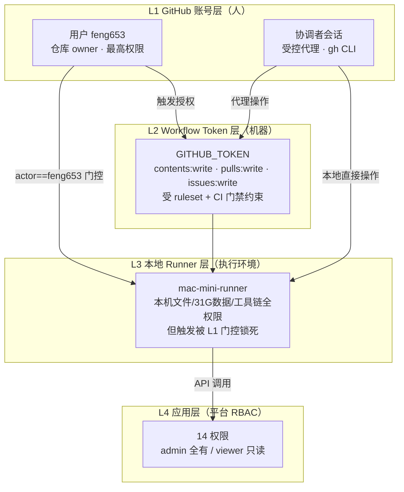
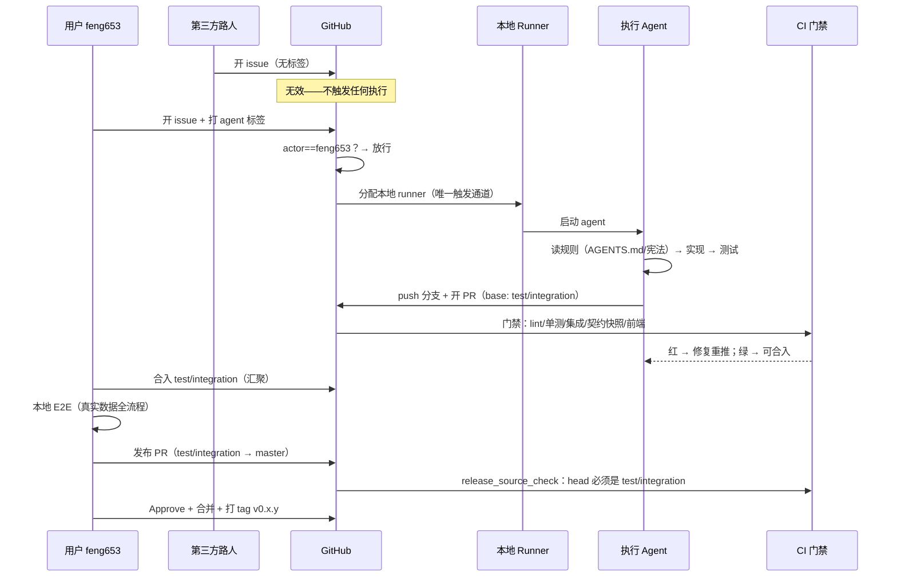
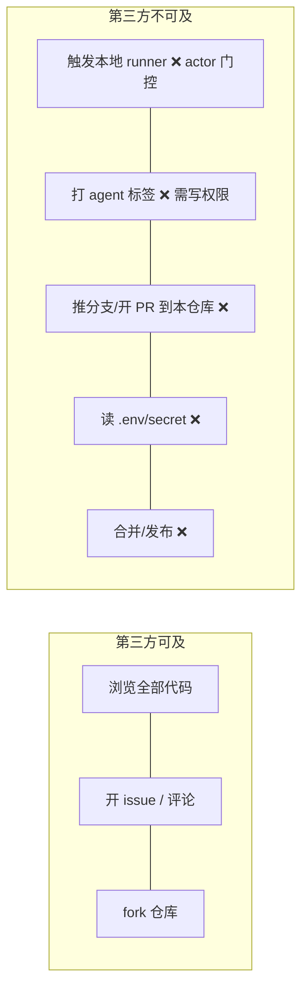

# 工作流权限体系（人机协作各级权限讲解）

> 生效日期：2026-08-05 ｜ 配套文档：`docs/WORKFLOW_AUTOMATION.md`（流程）、`docs/ARCHITECTURE_LEAN.md`（架构）
> 本文回答：**谁在什么条件下能做什么、什么被机器强制拦截、第三方能碰什么**。

## 一、权限分层总览（4 层）

**一句话**：L1 是人（你 + 受控协调者）；L2 是每个工作流运行时的一次性令牌；L3 是执行环境（权限最大但触发面最窄）；L4 是平台自己的权限模型（只管应用功能，不管仓库）。

## 二、角色权限矩阵（谁能在什么条件下做什么）

| 动作 | 用户 feng653 | 协调者会话 | 执行 agent（runner） | 第三方（公开仓库路人） |
|---|---|---|---|---|
| 开 issue | ✅ | ✅（代开） | ❌ | ✅（可建，无标签则无效） |
| 打 `agent` 标签（授权开工） | ✅ | ✅ | ❌ | ❌（无写权限，GitHub 强制） |
| 触发 agent | ✅（标签/`/oc`） | ✅ | ❌ | ❌（actor 门控拦截） |
| 读代码/数据 | ✅ | ✅ | ✅（仅任务范围） | ✅（公开仓库） |
| 写分支（非 master） | ✅ | ✅ | ✅（push 自己的分支） | ❌（无写权限） |
| 开 PR | ✅ | ✅ | ✅（base 强制 test/integration） | ✅（fork PR，但 CI 受限） |
| 合入 test/integration | ✅ | ✅ | ✅（PR 过 CI 后） | ❌ |
| 合入 master（发布） | ✅ | ✅ | ❌（来源检查强制 test/integration） | ❌ |
| Approve 行为变化 PR | ✅ | ✅ | ❌（不能批自己的活） | ❌ |
| 打 tag / 发布 | ✅ | ✅ | ❌ | ❌ |
| 配置仓库设置 | ✅ | ❌（除非你授权） | ❌ | ❌ |
| 删除实验/测试数据 | ✅（应用层 admin） | ✅（admin） | 按任务范围 | ❌ |

## 三、工作流中的权限时序（谁动哪个环节）

## 四、每层权限的强制机制（防"自觉"依赖）

| 权限点 | 强制机制（机器） | 依赖自觉？ |
|---|---|---|
| 第三方不能触发 agent | `github.actor == 'feng653'` 条件 | 无 |
| 无标签不执行 | workflow `if` 检查 agent 标签 | 无 |
| 并行不冲突 | check_parallel.py（domain/p:serial） | 无 |
| agent 不能直推 master | master-protection ruleset（pull_request + non_fast_forward + deletion） | 无 |
| 版本必过测试分支 | ci.yml `release_source_check`（base=master 且 head≠test/integration → 失败） | 无 |
| 端点行为不漂移 | 契约快照 diff（Required checks） | 无 |
| 行为变化需人确认 | 流程约定：行为变化 PR 由用户 Approve | ⚠️ 部分（快照 diff 机器可见，Approve 是人工） |
| agent 只做当前版本方向 | AGENTS.md + prompt 指示 | ⚠️ 依赖模型遵循 |

## 五、安全边界（公开仓库的真实风险面）

**风险结论**：公开仓库下第三方最多"看代码 + 建无标签 issue"；任何执行路径都被 actor 门控 + 标签门控 + ruleset 三层锁死。唯一残留风险是 fork PR 的 CI（GitHub 默认不给 fork PR 发 secret 与写 token，已由平台隔离）。

## 六、权限最小化原则（当前状态评估）

| 层 | 当前状态 | 备注 |
|---|---|---|
| L1 | 单一 owner（feng653），无协作者 | 最小面 |
| L2 | 工作流声明式最小权限（contents/pulls/issues write + id-token） | 已最小化 |
| L3 | runner 本机全权限 | **触发面已被 L1 门控锁死**；若未来多人协作需重估 |
| L4 | 14 权限 → 计划收敛为 2 档（v0.8.2 待办） | 在途 |
