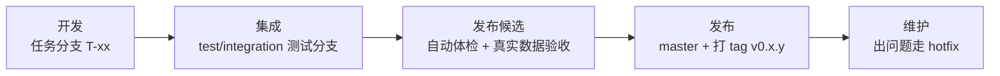
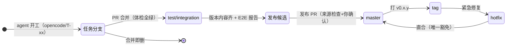
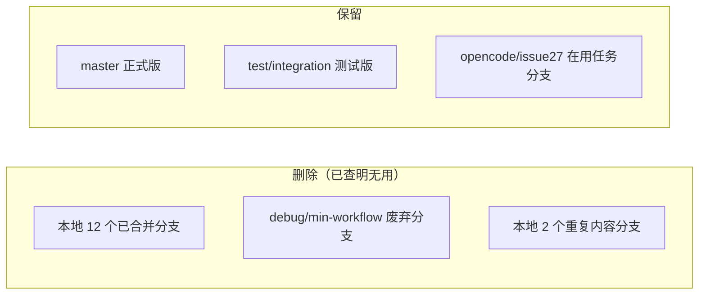
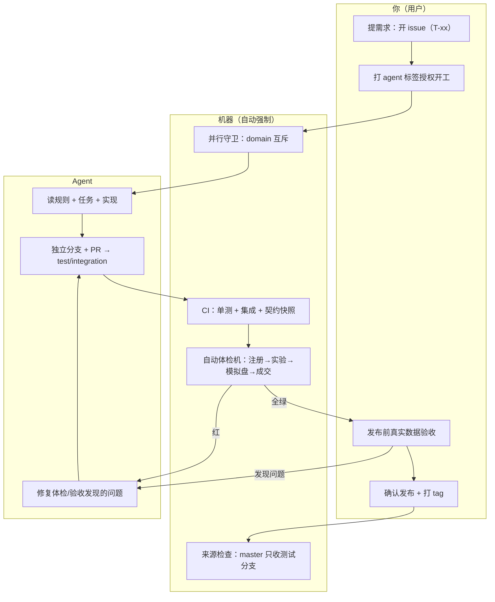
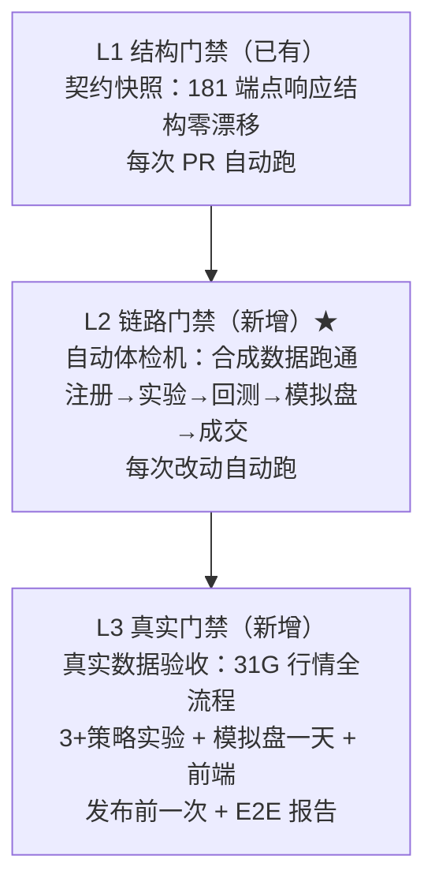
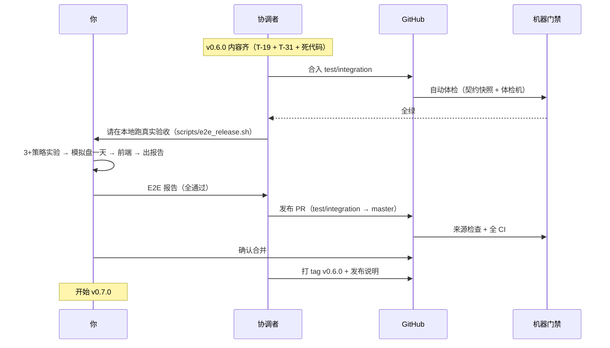

# 版本可用性与目标工作流（图文详解）

> 生效日期：2026-08-05 ｜ 状态：**方案文档**（按此实施）
> 配套文档：`docs/VERSIONING.md`（版本规则）、`docs/WORKFLOW_AUTOMATION.md`（自动化流程）、`docs/WORKFLOW_PERMISSIONS.md`（权限体系）、`docs/ARCHITECTURE_LEAN.md`（架构）

---

## 〇、这篇文档讲什么（大白话）

之前项目有两个病：
1. **版本号乱**——每个任务都带个版本号（"v0.8.4 模拟盘放宽"），任务还没发布就占了号，结果 0.7 还没做、0.8 先做了。
2. **改了能不能用没人保证**——测试都通过、端点结构都没变，但一跑真实实验就被关卡挡住，跑不通。

这篇文档就是**治这两个病的药方**：

> **版本号只在发布时定；发布前必过三层机器验证；分支用完即删。**

---

## 一、五个已确认的决策

| # | 你的决定 | 大白话 |
|---|---|---|
| ① | 版本号只在发布时定 | 任务不占版本号；凑够一批做完、验收通过，发布时才起一个版本名（v0.6.0） |
| ② | 补完 0.6 再往后排 | 先把 v0.6.0 补完发布，再 v0.7（数据）、v0.8（行为简化），不再跳序 |
| ③ | 没用的分支全删 | 15 个历史残留分支删除，只留正式版/测试版/在用的任务分支 |
| ④ | 每次发布都真实验收 | 发布前在你电脑上用真实数据完整跑一遍（实验→模拟盘），确认能用才发布 |
| ⑤ | 要自动体检机 | 造一套假数据自动体检，每次代码改动自动跑全流程，坏了立刻报红、合不进去 |

---

## 二、版本体系（版本号 = 发布名）

### 2.1 版本号规则

```
v0.6.0
 │ └┬┘
 │  └─ 修复号（PATCH）：已发布版本的小修复 → 0.6.1
 └──── 功能号（MINOR）：新功能/行为变化 → 0.7.0、0.8.0
```

**核心变化**：版本号只出现在"正式发布"那一刻（打 tag），**任务不再带版本号**。
任务用任务号 `T-xx`（如 T-19 端点删除）。

### 2.2 每个版本的旅程（生命周期）



| 阶段 | 谁做 | 门禁 |
|---|---|---|
| 开发 | Agent（本地 runner） | 契约快照 + 单测（每次 PR） |
| 集成 | 机器自动 | 自动体检机（每次改动） |
| 验收 | 你（本地真实数据） | E2E 报告（发布前一次） |
| 发布 | 协调者 + 你确认 | 来源检查 + 打 tag |
| 维护 | Agent（按需） | hotfix 直通道 |

### 2.3 版本序列（修正后，不再跳序）

| 发布 | 内容 | 状态 |
|---|---|---|
| **v0.6.0** | 死代码（已完成）+ 端点删除（T-19）+ 工具收敛（T-31） | 当前候选，补完发布 |
| **v0.7.0** | 数据收敛（T-20 设计 → T-21 对账 → T-22 复权 → T-23 双账本） | 待办 |
| **v0.8.0** | 行为简化（T-24 QA → T-25 权限 → T-26 异常 → T-27 模拟盘放宽 → T-28 字段） | 待办（模拟盘放宽已在测试分支） |

---

## 三、分支管理（谁存在、什么时候消失）

### 3.1 分支状态图



### 3.2 分支分类表

| 分支 | 类型 | 生命周期 | 用途 |
|---|---|---|---|
| `master` | 长命 | 永远 | 正式版（只收发布合并） |
| `test/integration` | 长命 | 永远 | 测试版（所有任务汇聚 + 体检） |
| `opencode/T-xx-*` | 短命 | 任务完成即删 | Agent 干活的分支 |
| `hotfix/vX.Y.Z-fix` | 短命 | 修复完即删 | 已发布版本出问题的紧急修复 |

### 3.3 当前清理动作（阶段 0）



---

## 四、目标工作流全流程（最终形态）



### 四层角色（谁做什么）

| 角色 | 做什么 | 不做什么 |
|---|---|---|
| **你** | 提需求、授权、真实验收、确认发布 | 不写代码、不修 bug |
| **Agent** | 实现、测试、修问题、开 PR | 不合并、不发布 |
| **机器** | 守卫、CI、体检、来源检查——**强制规则** | 不做判断 |
| **协调者（我）** | 拆任务、合测试分支、发起发布、打 tag | 发布需你确认 |

---

## 五、三层可用性门禁（"改不坏"的机器保证）



| 层 | 防什么 | 在哪跑 | 频率 |
|---|---|---|---|
| L1 契约快照 | 端点结构被改坏 | CI（每次 PR） | 高频 |
| L2 自动体检机 | **链路跑不通**（如 PIT 关卡挡路） | CI（每次改动） | 高频 |
| L3 真实验收 | 真实数据/环境问题 | 本地（发布前） | 低频 |

**为什么三层缺一不可**：L1 只保证"长相不变"，不保证"能用"（实证：PIT 关卡挡路时 CI 全绿）；L2 保证"链路能通"（合成数据）；L3 保证"真实环境能用"（真实数据）。

---

## 六、发布流程（版本怎么才算"发布"）



**发布硬条件（缺一不可）**：
1. 自动体检机全绿（机器）
2. 真实数据验收报告通过（你）
3. 发布 PR 来源合法 = test/integration（机器强制，已有 release_source_check）
4. 你确认合并（人）

---

## 七、权限体系（谁动得了什么）

详见 `docs/WORKFLOW_PERMISSIONS.md`（4 层权限详解）。速览：

| 动作 | 你 | Agent | 路人（公开仓库） |
|---|---|---|---|
| 触发 Agent | ✅ | ❌ | ❌（机器拦截） |
| 写分支 / 开 PR | ✅ | ✅（仅 test/integration） | ❌ |
| 合并测试分支 | ✅ | ✅ | ❌ |
| 发布 master / 打 tag | ✅ | ❌（来源检查强制） | ❌ |
| 看代码 | ✅ | ✅ | ✅（公开） |

---

## 八、实施路线（确认后按序执行）

| 阶段 | 做什么 | 交付 |
|---|---|---|
| **0 清理** | 删 15 残留分支、关 PR #32、issue 改 T-xx | 干净的分支 + 任务队列 |
| **1 版本体系** | 重写 VERSIONING.md + TODO_INDEX.md | 发布序列文档 |
| **2 自动体检机** | 写合成数据 E2E 套件 + 接入 CI | 机器强制链路门禁 |
| **3 真实验收** | 写 scripts/e2e_release.sh + 报告 | 发布前验收工具 |
| **4 流程固化** | 更新 AGENTS.md / WORKFLOW_AUTOMATION.md / ci.yml | 三层门禁固化 |
| **5 完成 v0.6.0** | T-19 端点删除 + T-31 工具收敛 → 验收 → 发布 v0.6.0 | 第一个"按新流程发布"的版本 |

---

## 九、一句话总结

> 任务只管做（T-xx），版本只在发布时定（v0.x.y）；每次改动机器自动体检，发布前你亲手用真实数据验收；分支用完即删。**改坏了合不进去，验收不过发不出来。**
