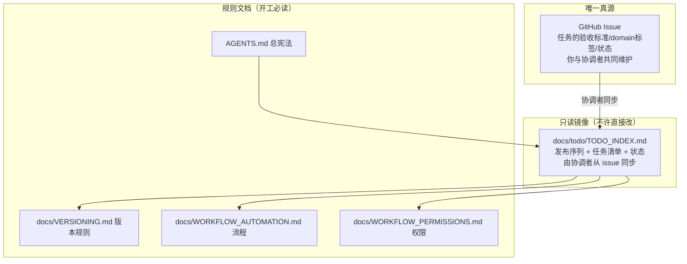
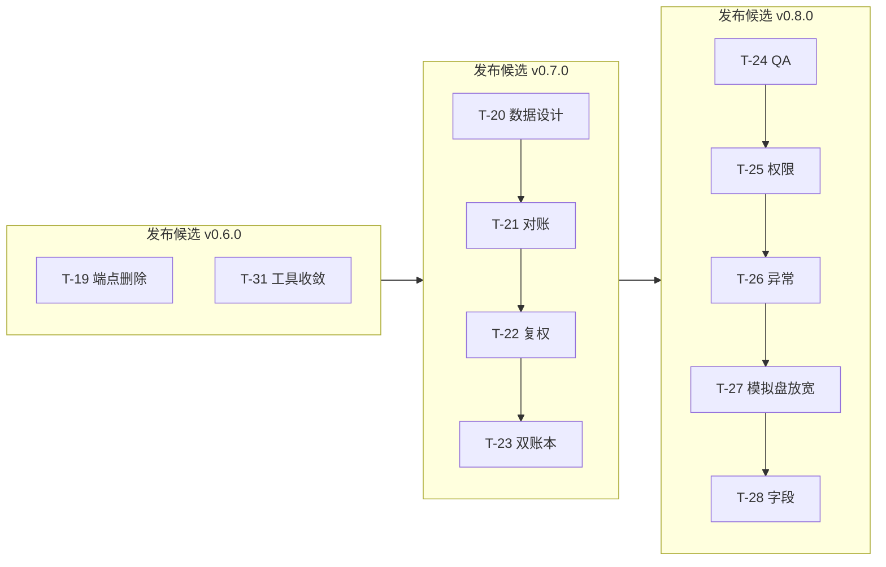
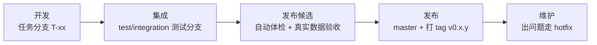
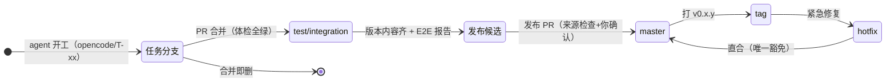
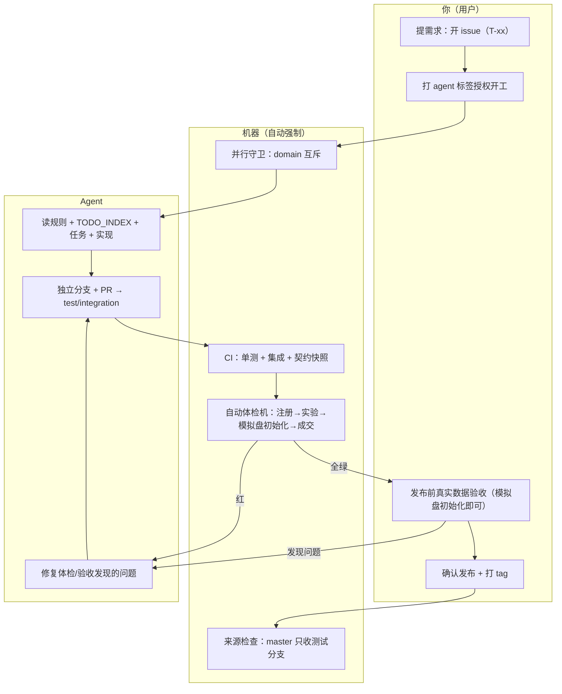
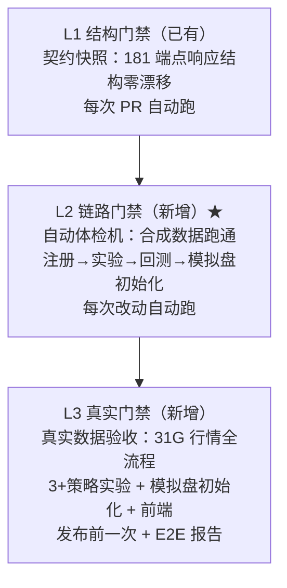

# 版本可用性与目标工作流（图文详解 + 实施任务清单）

> 生效日期：2026-08-05 ｜ 状态：**方案 + 实施计划**（按此执行）
> 配套文档：`docs/todo/TODO_INDEX.md`（工作唯一索引）、`docs/VERSIONING.md`（版本规则）、`docs/WORKFLOW_AUTOMATION.md`（自动化流程）、`docs/WORKFLOW_PERMISSIONS.md`（权限体系）、`docs/ARCHITECTURE_LEAN.md`（架构）

---

## 〇、这篇文档讲什么（大白话）

之前项目有两个病：
1. **版本号乱**——每个任务都带个版本号（"v0.8.4 模拟盘放宽"），任务还没发布就占了号，结果 0.7 还没做、0.8 先做了。
2. **改了能不能用没人保证**——测试都通过、端点结构都没变，但一跑真实实验就被关卡挡住，跑不通。

药方（已确认）：

> **版本号只在发布时定；发布前必过三层机器验证；分支用完即删。**

---

## 一、五个已确认的决策

| # | 你的决定 | 大白话 |
|---|---|---|
| ① | 版本号只在发布时定 | 任务不占版本号；凑够一批做完、验收通过，发布时才起一个版本名（v0.6.0） |
| ② | 补完 0.6 再往后排 | 先把 v0.6.0 补完发布，再 v0.7（数据）、v0.8（行为简化），不再跳序 |
| ③ | 没用的分支全删 | 15 个历史残留分支删除，只留正式版/测试版/在用的任务分支 |
| ④ | 每次发布都真实验收 | 发布前在你电脑上用真实数据完整跑一遍（实验→模拟盘**初始化**），确认能用才发布 |
| ⑤ | 要自动体检机 | 造一套假数据自动体检，每次代码改动自动跑全流程，坏了立刻报红、合不进去 |

**补充约定（模拟盘验收口径）**：E2E 中模拟盘验证到**初始化成功**即可（部署创建成功 + 状态 active + 基础数据就绪），**不需要等一个交易日跑完**。每日自动运行由调度器负责，E2E 只证"能部署、能初始化"。

---

## 二、TODO 文档体系（任务从哪来、谁说了算）

### 2.1 文档层级（谁是真源）



| 文档 | 地位 | 谁能改 |
|---|---|---|
| **GitHub Issue** | 任务真源（需求、验收标准、标签） | 你 + 协调者 |
| **docs/todo/TODO_INDEX.md** | 工作**唯一索引**（发布序列 + 状态镜像） | 仅协调者（从 issue 同步） |
| **docs/EXECUTION_TODO.md** | 兼容入口（指向 TODO_INDEX，不维护第二份队列） | 协调者 |
| **AGENTS.md / 四份宪法** | 规则（agent 开工必读） | 协调者（经 PR） |

### 2.2 TODO_INDEX 的地位与更新规则

```
角色分工：
  你（用户）     → 在 issue 上提需求、改验收标准（不动 TODO_INDEX）
  协调者（我）   → 把 issue 同步为 TODO_INDEX 的发布序列；每次状态变化更新
  Agent         → 只读 TODO_INDEX 判断"当前该做什么版本方向"；不许改

强制重读循环（AGENTS.md 规则，机器无法强制，靠文档 + prompt）：
  每次 开始/完成/切换/合并/发布 任务后 → 重读 TODO_INDEX.md → 继续下一个未完成项
  所有代码版本完成并发布后 → 才做无代码操作（真实数据验收等）
```

### 2.3 新队列形态（发布序列，取代"版本号标题"）



**issue 标题格式**（重命名后）：`T-19 端点删除（v0.6.0 候选）`——任务号在前、发布目标标注在后。

---

## 三、版本体系（版本号 = 发布名）

### 3.1 版本号规则

```
v0.6.0
 │ └┬┘
 │  └─ 修复号（PATCH）：已发布版本的小修复 → 0.6.1
 └──── 功能号（MINOR）：新功能/行为变化 → 0.7.0、0.8.0
```

**核心变化**：版本号只出现在"正式发布"那一刻（打 tag），任务不再带版本号。

### 3.2 每个版本的旅程（生命周期）



| 阶段 | 谁做 | 门禁 |
|---|---|---|
| 开发 | Agent（本地 runner） | 契约快照 + 单测（每次 PR） |
| 集成 | 机器自动 | 自动体检机（每次改动） |
| 验收 | 你（本地真实数据） | E2E 报告（发布前一次） |
| 发布 | 协调者 + 你确认 | 来源检查 + 打 tag |
| 维护 | Agent（按需） | hotfix 直通道 |

---

## 四、分支管理（谁存在、什么时候消失）

### 4.1 分支状态图



### 4.2 分支分类表

| 分支 | 类型 | 生命周期 | 用途 |
|---|---|---|---|
| `master` | 长命 | 永远 | 正式版（只收发布合并） |
| `test/integration` | 长命 | 永远 | 测试版（所有任务汇聚 + 体检） |
| `opencode/T-xx-*` | 短命 | 任务完成即删 | Agent 干活的分支 |
| `hotfix/vX.Y.Z-fix` | 短命 | 修复完即删 | 已发布版本出问题的紧急修复 |

---

## 五、目标工作流全流程（最终形态）



### 角色分工

| 角色 | 做什么 | 不做什么 |
|---|---|---|
| **你** | 提需求、授权、真实验收、确认发布 | 不写代码、不修 bug |
| **Agent** | 实现、测试、修问题、开 PR | 不合并、不发布、不改 TODO_INDEX |
| **机器** | 守卫、CI、体检、来源检查——**强制规则** | 不做判断 |
| **协调者（我）** | 拆任务、同步 TODO_INDEX、合测试分支、发起发布、打 tag | 发布需你确认 |

---

## 六、三层可用性门禁（"改不坏"的机器保证）



| 层 | 防什么 | 在哪跑 | 频率 |
|---|---|---|---|
| L1 契约快照 | 端点结构被改坏 | CI（每次 PR） | 高频 |
| L2 自动体检机 | **链路跑不通**（如 PIT 关卡挡路） | CI（每次改动） | 高频 |
| L3 真实验收 | 真实数据/环境问题 | 本地（发布前） | 低频 |

**为什么三层缺一不可**：L1 只保证"长相不变"，不保证"能用"（实证：PIT 关卡挡路时 CI 全绿）；L2 保证"链路能通"（合成数据）；L3 保证"真实环境能用"（真实数据）。

**模拟盘验收口径**：两层门禁中模拟盘均验证到**初始化成功**（部署创建 + 状态 active），不等待交易日运行。

---

## 七、发布流程（版本怎么才算"发布"）


**发布硬条件（缺一不可）**：
1. 自动体检机全绿（机器）
2. 真实数据验收报告通过（你，模拟盘初始化即可）
3. 发布 PR 来源合法 = test/integration（机器强制，已有 release_source_check）
4. 你确认合并（人）

---

## 八、实施任务清单（具体要做的每件事）

> 每阶段完成后向用户汇报验证结果，确认后才进下一阶段。

### 阶段 0：清理（先决，1 小时内）

| # | 任务 | 细节 | 验证 |
|---|---|---|---|
| 0.1 | 删除本地 15 个残留分支 | `git branch -D` 逐个删除：chore/protection-docs、docs/version-queue、feat/local-runner、feat/v0.3.0-contract-lock、feat/v0.5.0-errors、feat/v0.5.0-hashing、feat/v0.6.0-deadcode、fix/agent-pr-fallback、fix/ci-opencode-config、fix/cloud-git-creds、fix/comment-trigger-condition、fix/opencode-auto-approve、fix/opencode-github-token、fix/opencode-token-input、debug/min-workflow | `git branch` 只剩 master/test/integration |
| 0.2 | 删除远程废弃分支 | `git push origin --delete debug/min-workflow` | 远程只剩 master/test/integration/opencode/issue27 |
| 0.3 | 关闭 PR #32（不合并 master） | v0.8.4 内容已在 test/integration（07f344c）；关闭 PR 并留言说明归属 v0.8.0 发布 | PR 状态 closed |
| 0.4 | issue 重命名（10 个） | 标题 `[v0.x.y] xxx` → `T-xx xxx（v0.x.y 候选）`：T-19/T-20/T-21/T-22/T-23/T-24/T-25/T-26/T-27/T-28；另 T-31（canonical 收敛） | `gh issue list` 无版本号标题 |

### 阶段 1：版本体系改造（2 小时）

| # | 任务 | 细节 | 验证 |
|---|---|---|---|
| 1.1 | 重写 `docs/VERSIONING.md` | 版本号=发布名；SemVer 规则；发布生命周期图；hotfix 流程；"任务不带版本号"说明 | 文档评审 |
| 1.2 | 重写 `docs/todo/TODO_INDEX.md` | 发布序列队列（v0.6.0 候选：T-19+T-31；v0.7.0；v0.8.0）；并行矩阵保留；状态列改为 `待开始/进行中/待验收/完成` | 与 issue 列表一一对应 |
| 1.3 | 更新 `docs/EXECUTION_TODO.md` | 保持兼容入口语义（指向 TODO_INDEX） | 无第二份队列 |

### 阶段 2：自动体检机（核心工程，半天）

| # | 任务 | 细节 | 验证 |
|---|---|---|---|
| 2.1 | 核实数据格式（只读） | csi500.parquet MultiIndex 结构（已确认）、meta.json 字段、indexes/000905.parquet、calendar.json、pool_csi500.json——记录合成数据模板 | 格式文档 |
| 2.2 | 写合成数据 fixture | `tests/integration/conftest.py`：构造 10 股×300 交易日 pivot（MultiIndex: code×[open,high,low,close,volume,amount]）+ benchmark + calendar + pool json → 临时缓存目录 | fixture 可独立生成 |
| 2.3 | 写 `tests/integration/test_e2e_availability.py` | 全链路：①注册 admin → ②创建 3 个实验（ma_cross/macd/rsi，csi500，2024H1）→ ③轮询 job 完成（超时保护）→ ④断言指标/净值/交易落库 → ⑤部署模拟盘 → ⑥**模拟盘初始化确认**（部署 active，不等交易日）→ ⑦清理实验/部署记录 | 本地 pytest 全绿 |
| 2.4 | 验证 worker 可行性（关键风险点） | TestClient lifespan 里 job worker 能否跑完实验（回测 run_in_executor）；不行则改 subprocess uvicorn 真实进程方案 | 实验能跑完 |
| 2.5 | ci.yml 接入 | 新 job `e2e_availability`（合成数据，ubuntu）→ 纳入 Required checks | 故意改坏一处（如恢复 409 关卡）→ CI 红演示 |

### 阶段 3：真实验收脚本（半天）

| # | 任务 | 细节 | 验证 |
|---|---|---|---|
| 3.1 | 写 `scripts/e2e_release.sh` | preflight：①8000 端口归属验证（拒绝旧仓库进程）②磁盘≥5G ③worker 槽位/恢复任务清理 → 启动后端（test/integration + 真实数据）→ 注册/登录 → 3+ 策略实验 → 等完成 → 指标核对 → 部署模拟盘 → **初始化确认** → 前端启动 → 清理实验/部署 → 输出 E2E 报告 json | 脚本跑通，产出报告样例 |
| 3.2 | 报告模板 | `E2E 报告（json）：实验数/通过数/指标样本/模拟盘状态/前端状态/耗时` | 报告可读 |

### 阶段 4：流程固化（1 小时）

| # | 任务 | 细节 | 验证 |
|---|---|---|---|
| 4.1 | 更新 `AGENTS.md` | 发布 DoD 增加"E2E 报告必须"；分支生命周期（合并即删）；TODO reread loop 说明 | 文档评审 |
| 4.2 | 更新 `docs/WORKFLOW_AUTOMATION.md` | 三层门禁图 + 分支状态图 + TODO 地位（见本文档第二章引用） | 文档评审 |
| 4.3 | ci.yml 分支自动删除 | PR 合并后自动删 head 分支（`delete_branch_on_merge` 或 workflow 步骤） | 实测合并后分支消失 |

### 阶段 5：完成 v0.6.0（主线任务）

| # | 任务 | 细节 | 验证 |
|---|---|---|---|
| 5.1 | T-19 端点删除 | 64 个前端零引用候选逐端点取证（后端引用 + 防御价值）→ 只删确认无引用者 → 快照显式更新 → PR 列变更清单 → 你确认 | 每删除项有证据 |
| 5.2 | T-31 canonical 收敛 | 25 份私有 `_canonical_bytes/_content_sha256/_sha256_text` → core/hashing.py；分批替换（每批 5-8 模块）→ 相关测试 + 契约快照零 diff | grep 残留 = 0 |
| 5.3 | 自动体检机全绿 | 阶段 2 产物在 v0.6.0 内容上跑通 | CI 绿 |
| 5.4 | 真实验收 | scripts/e2e_release.sh 在 test/integration 跑通 → E2E 报告 | 报告全通过 |
| 5.5 | 发布 v0.6.0 | 发布 PR（test/integration → master）→ 你确认 → tag v0.6.0 + 发布说明 → TODO_INDEX 更新 | tag 存在 |
| 5.6 | 启动 v0.7.0 | TODO_INDEX 转 v0.7.0（T-20 数据设计先行） | 队列更新 |

---

## 九、风险与备选

| 风险 | 应对 |
|---|---|
| TestClient 里 job worker 跑不完实验 | 阶段 2.4 先验证；备选 subprocess uvicorn 真实进程 |
| 合成数据与真实数据行为差异 | L2 只证链路可达；L3 真实数据把关——两层互补 |
| issue 重命名影响并行守卫 | 守卫只依赖 domain/p:serial 标签，与标题无关 |
| v0.8.4 内容已在测试分支 | 按新队列归入 v0.8.0 发布；PR #32 关闭不合并 |

---

## 十、一句话总结

> 任务只管做（T-xx），版本只在发布时定（v0.x.y）；每次改动机器自动体检（模拟盘初始化即过），发布前你亲手用真实数据验收；分支用完即删。**改坏了合不进去，验收不过发不出来。**
