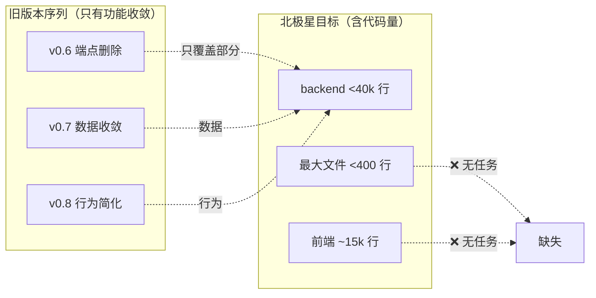
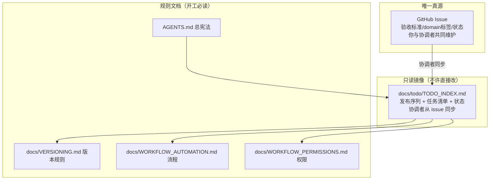
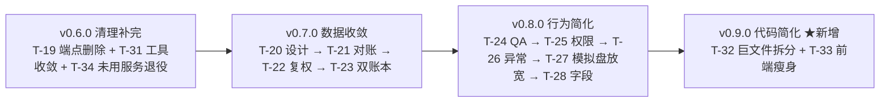
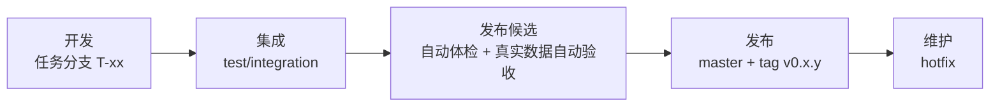
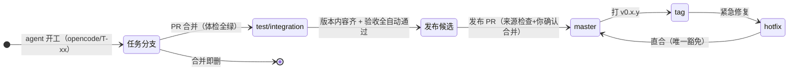
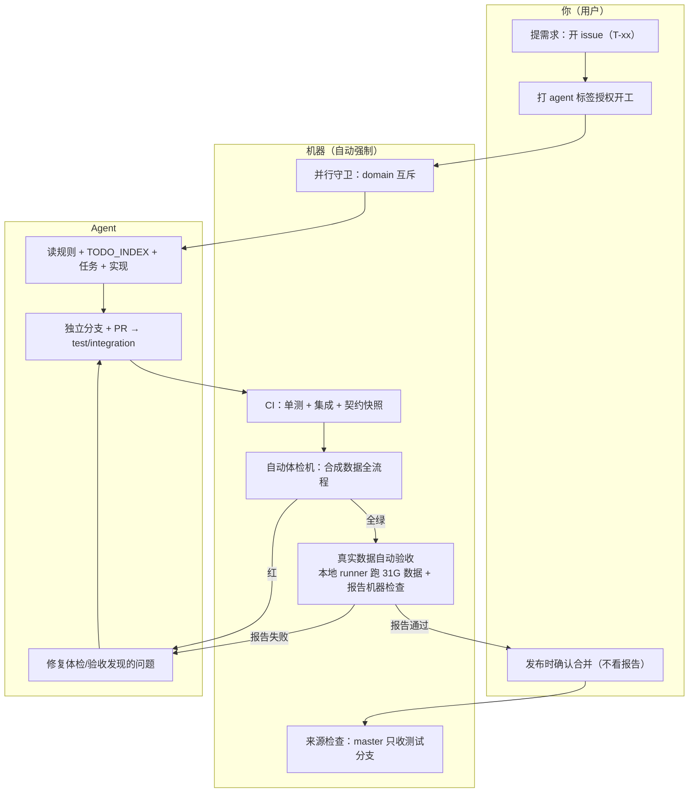
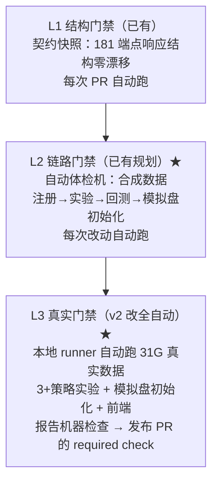
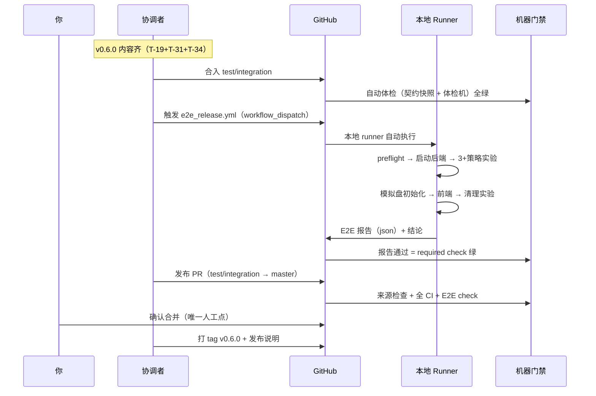

# 版本可用性与目标工作流（图文详解 + 实施任务清单）

> 生效日期：2026-08-05 v2 ｜ 状态：**方案 + 实施计划**（按此执行）
> 配套文档：`docs/todo/TODO_INDEX.md`（工作唯一索引）、`docs/VERSIONING.md`（版本规则）、`docs/WORKFLOW_AUTOMATION.md`（自动化流程）、`docs/WORKFLOW_PERMISSIONS.md`（权限体系）、`docs/ARCHITECTURE_LEAN.md`（北极星架构总目标）

---

## 〇、这篇文档讲什么（大白话）

之前项目有两个病：
1. **版本号乱**——每个任务都带个版本号，任务还没发布就占了号，0.7 还没做、0.8 先做了。
2. **改了能不能用没人保证**——测试都通过、端点结构都没变，但一跑真实实验就被关卡挡住，跑不通。

药方（已确认）：

> **版本号只在发布时定；发布前必过三层机器验证（全自动，不需人看）；分支用完即删。**

---

## 一、五个已确认的决策（v2 修订）

| # | 你的决定 | 大白话 | v2 修订 |
|---|---|---|---|
| ① | 版本号只在发布时定 | 任务不占版本号；发布时才起版本名（v0.6.0） | — |
| ② | 补完 0.6 再往后排 | 0.6 → 0.7（数据）→ 0.8（行为简化）→ **0.9（代码简化）** | 新增 0.9 |
| ③ | 没用的分支全删 | 15 个历史残留分支删除 | — |
| ④ | **真实数据验收全自动** | 发布前自动跑真实数据全流程（实验→模拟盘初始化），**报告由机器检查，无需你看** | **修订：原"你亲手验收"→全自动** |
| ⑤ | 要自动体检机 | 假数据自动体检，每次改动自动跑，坏了合不进去 | — |

**补充约定（模拟盘验收口径）**：E2E 中模拟盘验证到**初始化成功**即可（部署创建成功 + 状态 active + 基础数据就绪），**不需要等一个交易日跑完**。

---

## 二、北极星目标 ↔ 版本序列映射（回答"简化代码任务在哪"）

### 2.1 北极星总目标（docs/ARCHITECTURE_LEAN.md）逐项落实

| 北极星指标 | 目标 | 当前 | 由哪个任务达成 | 归属发布 |
|---|---|---|---|---|
| backend 生产代码 | <40,000 行 | 100,734 | 端点删除（T-19）+ 双账本退役（T-23，~5k 行）+ 未用服务退役（T-34）+ 死代码（已做 337） | v0.6 / v0.7 / v0.9 |
| main.py | <300 行 | 331 | ✅ 已达成（v0.4.0） | 完成 |
| 端点 | ~60 | 181 | T-19 端点删除 | v0.6.0 |
| 哈希/时间函数 | 各 1 份 | 26 份残留 | T-31 工具收敛 | v0.6.0 |
| 价格存储 | 1 套 | 4+ 套 | T-20~T-23 数据收敛 | v0.7.0 |
| 复权实现 | 1 套 | 7 处 | T-22 复权统一 | v0.7.0 |
| 权限 | 2 档 | 15 | T-25 权限收敛 | v0.8.0 |
| **最大文件** | **<400 行** | **4,176 行** | **T-32 巨文件拆分（19 个 >1000 行文件分批拆）+ T-23 删 price_ledger** | **v0.9.0 / v0.7.0** |
| **前端规模** | **~15,000 行** | **29,304 行** | **T-33 前端瘦身（死页面/死 store/未用 services）** | **v0.9.0** |
| 契约锁定 | 全部端点 | ✅ 已达成 | 完成 | 完成 |
| 死代码 | 0 | ✅ 已清 337 行 | 完成 | 完成 |

### 2.2 为什么之前版本序列"看不见"简化任务



**结论**：旧序列只做了"功能收敛"（删端点、并存储、砍权限），**漏了"代码简化"**（拆巨文件、瘦前端、砍总行数）——本次 v2 新增 **v0.9.0 代码简化发布**补全。

---

## 三、TODO 文档体系（任务从哪来、谁说了算）



| 文档 | 地位 | 谁能改 |
|---|---|---|
| **GitHub Issue** | 任务真源 | 你 + 协调者 |
| **docs/todo/TODO_INDEX.md** | 工作唯一索引（发布序列镜像） | 仅协调者 |
| **docs/EXECUTION_TODO.md** | 兼容入口（不维护第二份队列） | 协调者 |
| **AGENTS.md / 四份宪法** | 规则（agent 开工必读） | 协调者（经 PR） |

**强制重读循环**（AGENTS.md 规则）：每次 开始/完成/切换/合并/发布 后 → 重读 TODO_INDEX → 继续下一项；全部代码版本发布后才做无代码操作。

---

## 四、版本体系（版本号 = 发布名）

### 4.1 版本号规则

```
v0.6.0
 │ └┬┘
 │  └─ 修复号（PATCH）：已发布版本的小修复 → 0.6.1
 └──── 功能号（MINOR）：新功能/行为变化 → 0.7.0、0.8.0、0.9.0
```

### 4.2 版本序列（修正后，不再跳序）



| 发布 | 内容 | 北极星贡献 |
|---|---|---|
| **v0.6.0** | 端点删除（T-19）+ 工具收敛（T-31）+ 未用服务退役（T-34） | 端点 181→~60；行数 -5k+ |
| **v0.7.0** | 数据收敛（T-20→23） | 价格存储 1 套；删 price_ledger 4,176 行 |
| **v0.8.0** | 行为简化（T-24→28） | 权限 2 档；QA 死路拆除 |
| **v0.9.0** | **巨文件拆分（T-32）+ 前端瘦身（T-33）** | **最大文件 <400；前端 29k→15k；backend <40k** |

### 4.3 每个版本的旅程（生命周期）



---

## 五、分支管理（谁存在、什么时候消失）



| 分支 | 类型 | 生命周期 | 用途 |
|---|---|---|---|
| `master` | 长命 | 永远 | 正式版 |
| `test/integration` | 长命 | 永远 | 测试版（汇聚 + 体检） |
| `opencode/T-xx-*` | 短命 | 合并即删 | Agent 干活 |
| `hotfix/vX.Y.Z-fix` | 短命 | 修复完即删 | 紧急修复 |

---

## 六、目标工作流全流程（最终形态，含自动化验收）



### 角色分工

| 角色 | 做什么 | 不做什么 |
|---|---|---|
| **你** | 提需求、授权、发布时确认合并 | 不看验收报告、不写代码 |
| **Agent** | 实现、测试、修问题、开 PR | 不合并、不发布、不改 TODO_INDEX |
| **机器** | 守卫、CI、体检、**真实数据验收**、来源检查 | 不做判断 |
| **协调者**（= 任何在项目根启动的 opencode 会话，自动激活，见 AGENTS.md） | 发布 issue、管理/监视工作流、接受用户要求、分支和版本规划管理 | 不做用户要求之外的规划 |

> 协调者身份固定：在 quant-lean 根目录启动的任何 opencode agent 自动承担协调者角色（AGENTS.md「协调者角色」章节），角色边界由宪法文档强制。

---

## 七、三层可用性门禁（全部机器强制）



| 层 | 防什么 | 在哪跑 | 谁触发 | 谁看结果 |
|---|---|---|---|---|
| L1 契约快照 | 结构被改坏 | CI（云端） | 每次 PR 自动 | 机器 |
| L2 自动体检机 | 链路跑不通 | CI（云端） | 每次改动自动 | 机器 |
| L3 真实验收 | 真实数据/环境问题 | 本地 runner | 发布前自动（workflow_dispatch） | **机器（报告即 required check）** |

**v2 关键变化**：L3 不再需要你"亲手跑 + 看报告"——`e2e_release.yml` workflow 在本地 runner 自动执行真实数据全流程，报告通过结论作为**发布 PR 的 required check**，报告失败则发布 PR 无法合并。你全程不参与验收环节。

---

## 八、发布流程（全自动验收版）



**发布硬条件（缺一不可，均机器强制）**：
1. 自动体检机全绿
2. **真实数据验收报告通过（机器检查，required check）**
3. 发布 PR 来源合法 = test/integration（release_source_check）
4. 你确认合并（唯一人工确认点，行为变化版本）

---

## 九、实施任务清单（具体要做的每件事）

> 每阶段完成后汇报验证结果，确认后才进下一阶段。

### 阶段 0：清理（1 小时内）

| # | 任务 | 细节 | 验证 |
|---|---|---|---|
| 0.1 | 删除本地 15 个残留分支 | `git branch -D` 逐个删（chore/docs/feat×5/fix×7/debug 全列表见 git branch） | 只剩 master/test/integration |
| 0.2 | 删除远程 debug/min-workflow | `git push origin --delete debug/min-workflow` | 远程分支干净 |
| 0.3 | 关闭 PR #32（不合并 master） | v0.8.4 内容已在 test/integration；留言归属 v0.8.0 | PR closed |
| 0.4 | **GitHub issue 清理（重命名）** | 11 个 OPEN issue 标题 `[v0.x.y] xxx` → `T-xx xxx（v0.y.z 候选）`：<br/>#19→T-19 端点删除（v0.6.0 候选）｜#20→T-20 数据设计（v0.7.0 候选）｜#21→T-21 对账（v0.7.0 候选）｜#22→T-22 复权（v0.7.0 候选）｜#23→T-23 双账本（v0.7.0 候选）｜#24→T-24 QA（v0.8.0 候选）｜#25→T-25 权限（v0.8.0 候选）｜#26→T-26 异常（v0.8.0 候选）｜#27→T-27 模拟盘放宽（v0.8.0 候选）｜#28→T-28 字段（v0.8.0 候选）｜#31→T-31 canonical（v0.6.0 候选） | `gh issue list` 无版本号标题 |
| 0.5 | **新建任务 issue** | T-32 巨文件拆分（v0.9.0 候选，19 个 >1000 行文件分批拆到 <400）｜T-33 前端瘦身（v0.9.0 候选，29,304→~15,000）｜T-34 未用服务退役（v0.6.0 候选，research_workflow 等取证后删）——均带 domain 标签 + 验收标准 | 3 个 issue 存在 |
| 0.6 | **issue 状态与标签整理** | ① #27 实现已完成（在测试分支）→ 移除 `agent` 标签，避免守卫误判进行中；② 全部 OPEN issue 核对 domain/behavior-change/p:serial 标签与新发布目标一致；③ 已关闭的 #1-#6 补迁移说明 comment（指向新任务号） | 标签与队列一致，无残留 agent 标签 |

### 阶段 1：版本体系改造（2 小时）

| # | 任务 | 细节 | 验证 |
|---|---|---|---|
| 1.1 | 重写 docs/VERSIONING.md | 版本号=发布名；SemVer；生命周期；hotfix；含 v0.9.0 序列 | 评审 |
| 1.2 | 重写 docs/todo/TODO_INDEX.md | 发布序列队列（v0.6→0.9）；北极星映射摘要；并行矩阵保留 | 与 issue 对应 |
| 1.3 | 更新 docs/EXECUTION_TODO.md | 兼容入口语义 | 无第二队列 |
| 1.4 | 新建 T-32/T-33/T-34 issue | 巨文件拆分 / 前端瘦身 / 未用服务退役（验收标准写入） | issue 存在 |

### 阶段 2：自动体检机（核心工程，半天）

| # | 任务 | 细节 | 验证 |
|---|---|---|---|
| 2.1 | 核实数据格式（只读） | pivot MultiIndex + meta.json + benchmark + calendar + pool 模板 | 格式文档 |
| 2.2 | 合成数据 fixture | tests/integration/conftest.py：10 股×300 日 + benchmark + calendar + pool | fixture 可生成 |
| 2.3 | tests/integration/test_e2e_availability.py | 注册→3 实验→job 完成→指标→部署模拟盘→**初始化确认**→清理 | 本地全绿 |
| 2.4 | 验证 worker 可行性 | TestClient lifespan 跑实验；不行改 subprocess uvicorn | 实验能跑完 |
| 2.5 | ci.yml 接入 | e2e job → Required checks | 故意改坏 → CI 红 |

### 阶段 3：真实数据自动验收（v2 改自动化，半天）

| # | 任务 | 细节 | 验证 |
|---|---|---|---|
| 3.1 | scripts/e2e_release.sh | preflight（端口归属/磁盘≥5G/worker 槽位/旧任务清理）→ 启动后端 → 3+ 策略实验 → 指标核对 → 模拟盘初始化 → 前端 → 清理实验 → 输出 E2E 报告 json + 退出码（0=通过） | 本地跑通 |
| 3.2 | `.github/workflows/e2e_release.yml` | workflow_dispatch 触发；runs-on [self-hosted, macos]；actor==feng653 门控；跑脚本；报告存 artifact；job 名 `e2e-release-verification`（结论=报告退出码） | workflow 可触发 |
| 3.3 | 接入发布门禁 | master 保护 ruleset 的 required_status_checks 增加 `e2e-release-verification` context → 发布 PR 必须 E2E 绿 | 发布 PR 无 E2E check 不可合并 |

### 阶段 4：流程固化（1 小时）

| # | 任务 | 细节 | 验证 |
|---|---|---|---|
| 4.1 | 更新 AGENTS.md | 发布 DoD（E2E check 必须）；分支合并即删；TODO reread loop | 评审 |
| 4.2 | 更新 docs/WORKFLOW_AUTOMATION.md | 三层门禁 + 自动验收 + TODO 地位 | 评审 |
| 4.3 | ci.yml 分支自动删除 | delete_branch_on_merge 或 workflow 步骤 | 实测 |

### 阶段 5：完成 v0.6.0（主线）

| # | 任务 | 细节 | 验证 |
|---|---|---|---|
| 5.1 | T-19 端点删除 | 64 候选取证 → 删确认无引用 → 快照显式更新 → 变更清单 | 每项有证据 |
| 5.2 | T-31 canonical 收敛 | 25 份 → core/hashing.py，分批替换 | grep 残留=0 |
| 5.3 | T-34 未用服务退役 | research_workflow 晋级流等（前端零引用取证后）→ 删 ~2.4k 行 | 取证 + 测试 |
| 5.4 | 体检机 + 真实验收全绿 | 阶段 2/3 产物在 v0.6.0 内容上自动通过 | CI + e2e check 绿 |
| 5.5 | 发布 v0.6.0 | 发布 PR → 你确认 → tag + 说明 → TODO_INDEX 更新 | tag 存在 |

### 阶段 6：v0.7.0 / v0.8.0（数据 + 行为简化）

按 TODO_INDEX 序列：T-20→T-23（数据收敛，v0.7.0 发布）；T-24→T-28（行为简化，v0.8.0 发布）。每发布同 v0.6.0 流程（体检 + 自动验收 + 发布）。

### 阶段 7：v0.9.0 代码简化（补北极星缺口）

| # | 任务 | 细节 | 验证 |
|---|---|---|---|
| 7.1 | T-32 巨文件拆分（分批） | 19 个 >1000 行文件按批拆到 <400：①broker.py(3498) ②experiments.py(2914)+trading.py(2781) ③data.py(1994)+cache.py(1835) ④simulation(1710)+backtest_runner(1701) ⑤pit_evidence_governance(2323)+csindex_history(2085) ⑥其余（point_in_time_master/source_validation/migrate/maintenance 等）；facade 模式，契约快照零 diff 兜底 | 每批快照零 diff + 全部 <400 |
| 7.2 | T-33 前端瘦身 | 死页面/死 store/未用 services 取证 → 删除 → 前端 build + 契约对照 | 29,304→~15,000 |
| 7.3 | 行数审计 | 每批记录 backend 总行数变化，追踪 <40,000 进度 | 进度表 |

---

## 十、风险与备选

| 风险 | 应对 |
|---|---|
| TestClient 里 worker 跑不完实验 | 阶段 2.4 先验证；备选 subprocess uvicorn |
| 合成数据与真实数据差异 | L2 证链路、L3 证真实，互补 |
| e2e_release.yml 在本地 runner 的稳定性 | preflight 硬检查 + actor 门控；失败自动报告给 agent 修复 |
| 巨文件拆分工作量大 | 分批（每批 1-2 文件），每批独立 PR + 快照零 diff；不追求一次完成 |
| 前端瘦身误删在用页面 | 取证（路由可达性 + 引用图）后才删，与端点删除同原则 |

---

## 十一、一句话总结

> 任务只管做（T-xx），版本只在发布时定（v0.x.y）；每次改动机器自动体检，**发布前真实数据验收全自动（机器检查）**；分支用完即删；代码简化（拆巨文件/瘦前端）是 v0.9.0 的正式发布内容。**改坏了合不进去，验收不过发不出来。**
